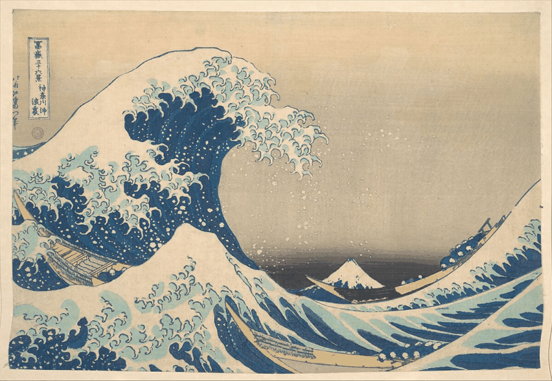

# Luca Elian

### 「 Drepsott 」

**Programming Student · UTN**

波　Software Development　・　Argentina

  

<em>Learning through projects, curiosity and probably too many Doritos.</em>

 

---

## 自己紹介 · About Me

I'm currently pursuing a **Technical Degree in Programming at Universidad Tecnológica Nacional (UTN)** in Argentina.

I enjoy learning through projects and building software, with a particular interest in **application development, databases and software architecture**.

My projects currently include web and desktop applications developed with **C#, ASP.NET Web Forms, SQL Server, C++, Python and CustomTkinter**.

 

<table align="center">
<tr>
<td align="center">

</td>
</tr>
</table>

 

---

## 技術 · Tech Stack

  

  

 

---

## 作品 · Selected Work

<table>
<tr>
<td width="50%" valign="top">

### [Clinic Manager](https://github.com/LucaElian/clinic-manager)

Medical clinic management system built with **ASP.NET Web Forms, C# and SQL Server**, featuring appointments, patients, doctors and reporting.

<code>C#</code> <code>ASP.NET Web Forms</code> <code>SQL Server</code>

</td>

<td width="50%" valign="top">

### [Hardware Manager](https://github.com/LucaElian/hardware-manager)

Hardware inventory and sales management system built in **C++**, featuring stock control, customers, vendors and reporting.

<code>C++</code> <code>OOP</code> <code>Inventory</code>

</td>
</tr>

<tr>
<td width="50%" valign="top">

### [Municipal Helpdesk](https://github.com/LucaElian/municipal-helpdesk)

Desktop IT support management system built in **Python** for a municipality, featuring ticketing, user administration, reporting and dashboards.

<code>Python</code> <code>CustomTkinter</code> <code>SQLite</code>

</td>

<td width="50%" valign="top">

### [Cien O Escalera](https://github.com/LucaElian/CienOEscalera)

Console dice game built in **C++**, featuring single-player, two-player, ranking and simulation modes.

<code>C++</code> <code>Console</code> <code>Simulation</code>

</td>
</tr>
</table>

 

---

## 統計 · Languages

 

---

### 波

Learning through building.

