 

波　Software Development　·　Argentina

 

## 自己紹介 · About Me

I'm currently pursuing a **Technical Degree in Programming at Universidad Tecnológica Nacional (UTN)** in Argentina.

I enjoy learning through projects and building software with a particular interest in **application development, databases and software architecture**.

My current work includes web and desktop applications using **C#, ASP.NET Web Forms, SQL Server, C++, Python and CustomTkinter**.

 

---

## 技術 · Tech Stack

 

 

 

---

## 作品 · Selected Work

### [Clinic Manager](https://github.com/LucaElian/clinic-manager)

Medical clinic management system built with **ASP.NET Web Forms, C# and SQL Server**, featuring appointment scheduling, patient and doctor management, dashboards and reports.

`C#`　`ASP.NET Web Forms`　`SQL Server`　`Bootstrap`

 

### [Hardware Manager](https://github.com/LucaElian/hardware-manager)

Hardware inventory and sales management system built in **C++**, featuring stock control, customers, vendors and reporting.

`C++`　`OOP`　`Inventory`　`Sales`

 

### [Municipal Helpdesk](https://github.com/LucaElian/municipal-helpdesk)

Desktop IT support management system built in **Python** for a municipality, featuring ticketing, user administration, reporting and dashboards.

`Python`　`CustomTkinter`　`SQLite`　`Helpdesk`

 

### [Cien O Escalera](https://github.com/LucaElian/CienOEscalera)

Console dice game built in **C++**, featuring single-player, two-player, ranking and simulation modes.

`C++`　`Console`　`Dice Game`　`Simulation`

 

---

## 統計 · GitHub Stats

 

---

### 波

Learning through building.

